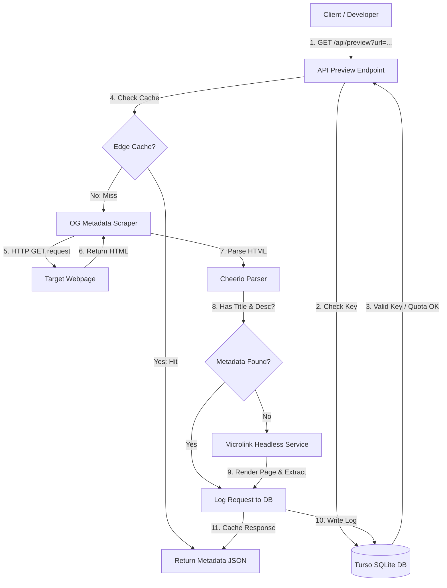

# Link Preview API Architecture

## Overview
This project provides a robust, fast Open Graph (OG) metadata extraction API and a comprehensive Dashboard for managing link previews. It is built as a complete Next.js full-stack application backed by a Turso SQLite database.

## Tech Stack
- **Framework**: Next.js 15 (App Router)
- **Styling**: Vanilla CSS (Premium Dark Theme)
- **Database**: Turso Edge SQLite (via `@libsql/client`)
- **State Management**: Zustand (persisted state with backend synchronization)
- **HTML Parsing**: Cheerio (Server-side metadata extraction)
- **Headless Fallback**: Microlink API (Headless browser fallback for JS-rendered pages)
- **Deployment**: Unified Vercel Deployment (hosting both UI and Serverless API routes)

## Execution Flow & Caching Strategy
1. **API Endpoint (`/api/preview`)**
   - Receives target URL and API key validation check.
   - Enforces key validation against the Turso `api_keys` table.
   - Logs requests asynchronously to the `api_usage_logs` table.
   - Triggers `fetchOGMetadata`.
   - AbortController terminates after 8000ms to prevent hanging.
   - Caching headers (`Cache-Control: public, s-maxage=3600, stale-while-revalidate=86400`) enforce downstream edge caching to ensure <2s response times on repeated calls.

2. **Parser Logic (`lib/og-parser.ts`)**
   - Fetches the HTML string via standard `fetch`, automatically handling redirect chains.
   - Parses the HTML tree to Memory using Cheerio (lightweight, fast, O(N) complexity).
   - Uses prioritized selector fallbacks to extract metadata (including Twitter Cards).
   - Resolves relative URLs (images, favicons) to canonical absolute URLs.
   - **Headless Fallback**: If the initial fetch fails to retrieve page title/description (which is common on JavaScript-rendered React/SPA pages), the parser automatically falls back to a headless browser service (Microlink API) to extract the metadata profile.

3. **Rate Limiting (`lib/rate-limit.ts`)**
   - Enforces a rate limit of 60 requests per minute per key using an in-memory window tracking map.

## Embed Snippet Generation
The HTML embed snippet delegates to an iframe-based rendering layer via `/embed/page.tsx`. It fetches the OG metadata on the server-side and embeds it securely in a self-enclosed container, preventing CSS or DOM conflicts with the host website.

## API Key Authentication & User Accounts
- **Database Schema**:
  - `users` (id, name, email, password, quota_limit)
  - `api_keys` (id, key_value, user_id, name, status, allowed_origins)
  - `api_usage_logs` (id, key_id, target_url, status_code, duration_ms, created_at)
- **Authentication**: Users register and log in via secure `/api/auth` endpoints. Zustand handles client session state and triggers real-time syncing.
- **Key CRUD & Logging**: Custom keys can be created or revoked dynamically through `/api/keys`. Usage stats and request logs are fetched dynamically via `/api/logs` and updated through polling.

## Conclusion
The architecture is serverless and edge-ready, combining fast static parsing with a headless browser fallback and full-stack database persistence, resulting in a production-ready link preview SaaS.
